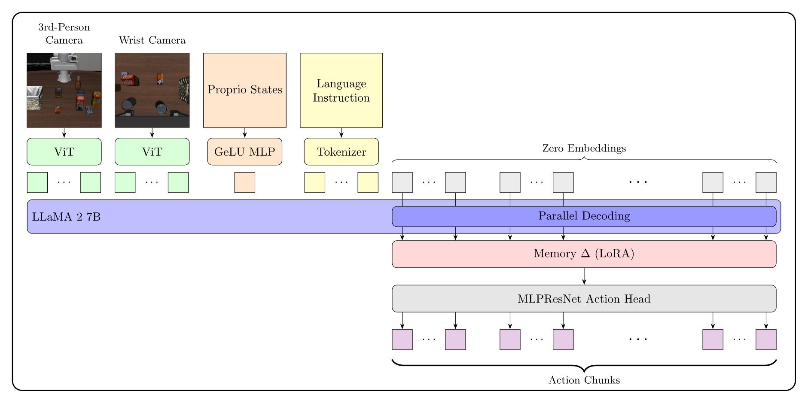

# SOAP: Surprise-Weighted Episodic Memory for Test-Time Adaptation

Implementation for the paper *Surprise-Weighted Episodic Memory for Test-Time Adaptation in Long-Horizon Manipulation*.

SOAP augments a pretrained OpenVLA-OFT backbone with a low-rank episodic memory tensor updated at test time via proprioceptive prediction error, instantiating an analogue of surprise-modulated hippocampal encoding from complementary learning systems theory.



---

## Repository Structure

```
soap_implementation/
├── adapt.py                  # Main SOAP evaluation script
├── inference.py              # ProprioHead surprise computation
├── mlp_train.py              # ProprioHead training
├── latent_inference.py       # LatentHead world-model surprise computation (ablation)
├── latent_train.py           # LatentHead training (ablation)
├── collect_rollout_pairs.py  # Rollout data collection
├── datacollect.py            # Data collection utilities
├── verify_collect.py         # Collection verification
├── analyze.py                # Results analysis
└── checkpoints/
    ├── soap_mlp_v3.pt        # Trained ProprioHead MLP
    ├── soap_b_mem.pt         # Meta-trained B_mem projection (optional)
    └── soap_latent_head.pt   # Trained LatentHead (optional; enables "latent" ablation mode)
```

---

## Dependencies

### 1. openvla-oft

Clone and install as a sibling directory to this repo:

```bash
git clone https://github.com/moojink/openvla-oft.git
```

The expected directory layout is:

```
your-workspace/
├── SOAP/                  # this repo
│   └── soap_implementation/
└── openvla-oft/           # sibling directory
```

### 2. LIBERO

Clone and install inside the openvla-oft directory:

```bash
cd openvla-oft
git clone https://github.com/Lifelong-Robot-Learning/LIBERO.git
```

### 3. Python Environment

Python 3.10 is required. Using uv:

```bash
uv venv --python 3.10
source .venv/bin/activate

# Install PyTorch with CUDA 12.1 support
uv pip install torch==2.2.0 torchvision==0.17.0 torchaudio==2.2.0 \
    --index-url https://download.pytorch.org/whl/cu121

# Install openvla-oft and its dependencies
uv pip install -e openvla-oft
uv pip install -e openvla-oft/LIBERO

# Install SOAP and remaining dependencies
uv pip install -r SOAP/soap_implementation/requirements.txt
```

---

## Replicating Experimental Results

All evaluations run 50 episodes per task across 10 tasks (500 total rollouts) and compare modes simultaneously: SOAP (`surprise`), undirected random updates (`random`), a latent world-model surprise ablation (`latent`, optional — see below), and vanilla OpenVLA-OFT (`baseline`).

From the `soap_implementation/` directory:

```bash
PYTHONPATH=/path/to/openvla-oft/LIBERO python adapt.py --suite libero_10
```

Available suites:

| Suite | Flag |
|-------|------|
| LIBERO-Long | `--suite libero_10` |
| LIBERO-Spatial | `--suite libero_spatial` |
| LIBERO-Object | `--suite libero_object` |
| LIBERO-Goal | `--suite libero_goal` |

Checkpoints are downloaded automatically from HuggingFace on first run.

### Results (LIBERO-Long, 500 rollouts)

| Mode | Success Rate |
|------|-------------|
| SOAP | 95.2% (476/500) |
| Latent world-model surprise | 93.4% (467/500) |
| Baseline | 92.0% (460/500) |
| Random updates | 16.4% (82/500) |

All results obtained under 4-bit quantization on an NVIDIA RTX 4070 Super.

---

## Key Hyperparameters

| Parameter | Value | Description |
|-----------|-------|-------------|
| `MEM_RANK` | 8 | Rank of B_mem / A_mem |
| `MEM_ALPHA` | 8 | LoRA scaling (alpha/rank = 1.0) |
| `ETA` | 1e-3 | Hebbian learning rate |
| `DECAY` | 0.99 | Exponential forgetting factor |
| `ETA_S` | 0.9 | Titans surprise momentum |
| `THETA_S` | 1.0 | Surprise gradient scale |
| `SURPRISE_THRESHOLD` | 0.0 | Minimum MSE to trigger A_mem write |

To use the meta-trained B_mem projection instead of random init, set `B_MEM_PATH` in `adapt.py`:

```python
B_MEM_PATH = os.path.join(_HERE, "checkpoints", "soap_b_mem.pt")
```

---

## Ablations

### Latent world-model surprise (`latent` mode)

An additional non-random ablation alongside `random`: instead of gating A_mem writes on
*proprioceptive* prediction error, `latent` mode gates on prediction error over the VLA's
own next action-hidden-state h_{t+1} (projected into a 64-dim subspace). This isolates
whether it's specifically proprioception that makes SOAP work, or whether any predictive-
coding surprise signal over the model's own latent trajectory works comparably. **Note that this is an active work in progress!**

To enable it:

```bash
# 1. Collect rollout pairs (now includes h_{t+1}; safe to rerun — per-task checkpoints
#    without the new field are backfilled with zeros, so delete stale ones under
#    ./datasets/rollout_checkpoints/ to actually pick up h_{t+1}).
cd openvla-oft
python collect_rollout_pairs.py

# 2. Train LatentHead on the collected pairs.
python latent_train.py
# → saves ./datasets/soap_latent_head_v1.pt

# 3. Promote the trained checkpoint into soap_implementation/checkpoints/.
cp datasets/soap_latent_head_v1.pt ../SOAP/soap_implementation/checkpoints/soap_latent_head.pt
```

`adapt.py` checks for `checkpoints/soap_latent_head.pt` at startup — if present, `latent`
is automatically added to the evaluation modes (`surprise`, `random`, `latent`, `baseline`);
if absent, `adapt.py` runs as before with a printed notice.

To compare only specific modes when summarising results:

```bash
python analyze.py --results_dir ./logs/adapt_libero_10 --modes surprise random latent baseline
```

---

## Output

Results are written per-task to `soap_implementation/logs/adapt_{suite}/results_task{N}.json`. Each record contains task index, episode index, mode, success, and mean surprise value. Rollout videos and surprise curves are saved for any episode where the SOAP or baseline model fails.
